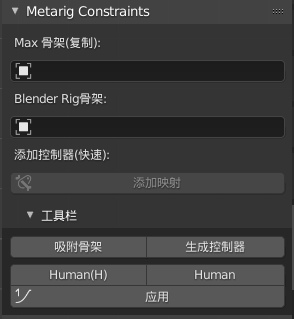
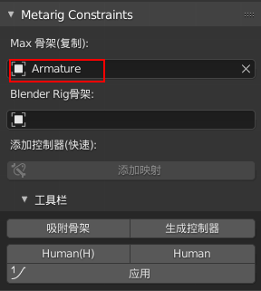
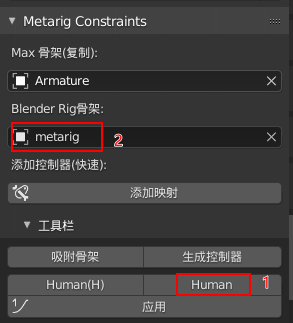
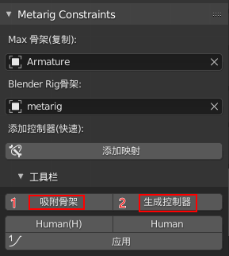
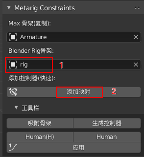
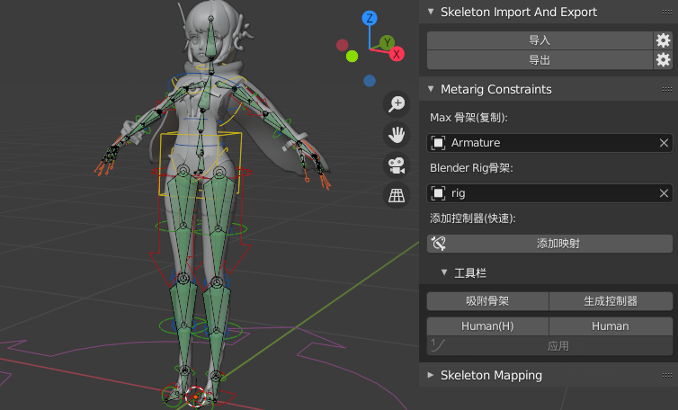
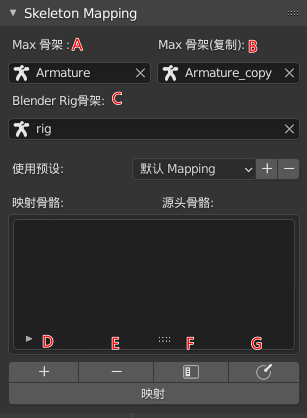
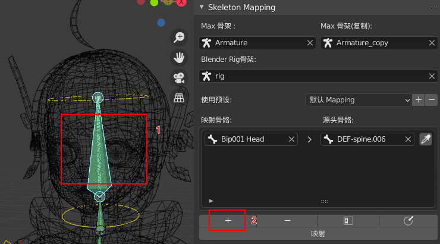
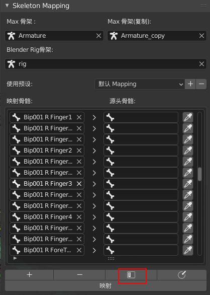
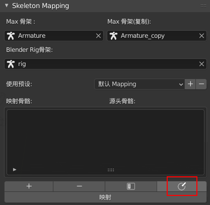

# Bl_Max骨骼映射插件

[TOC]

#### 1 使用前提准备

环境是Blender2.92，其他版本可能会有些问题

##### 1.1 安装步骤

打开 blender，点击 **Edit — Preferences — Add_ons — Install** ，选择blmaxbones插件的压缩包直接安装，勾选后运行 ；
> 中文 ： 编辑 — 偏好设置 — 插件 — 安装 

 

##### 1.2 Rigify 插件
因为插件调用了blender官方社区插件 Rigify 的一些接口，这个插件需要提前打开 ;
打开 blender，点击 **Edit — Preferences — Add_ons — Community** ，搜索框搜索 Rigify 插件后勾选后运行 ；

> 中文 ： 编辑 — 偏好设置 — 插件 — 社区版

 

#### 2 插件使用

##### 2.1 插件目录

在blender的View3D窗口的侧边栏找到Blmaxbones插件，插件主要分为三个模块

 

> 1. Skeleton Import And Export 
>
>    骨架资源的导入导出
>
> 2. Metarig Constraints
>
>    对特定max骨架和blender rig骨架进行快速处理和绑定
>
> 3. Skeleton Mapping
>
>    对特定骨骼进行映射

##### 2.2 Skeleton Import And Export 

点击导入或者导出是对特定的骨骼默认参数进行资源的设置；

想自行设定blender FBX的参数也可以点击“齿轮”进行设置；

 

##### 2.3 Metarig Constraints

 对默认max骨架进行快速的准备和映射，也可在工具栏使用相应的功能

 

##### 示例：（max bip骨架）

1. 在Max骨架框中选择max骨架

  

2.blender Rig骨架部分，先在工具栏中点击Human生成metarig骨架

 

3.在blender Rig骨架框中选择metarig后，点击吸附骨骼和生成控制器

  

4.最后在blender Rig骨架框中选择生成的rig，添加添加映射

 

5.映射成功

 

##### 2.3 Skeleton Mapping

第三部分是骨骼的映射表，我们上述过程是对三幅骨架进行一系列操作来执行映射关系；

Skeleton Mapping 部分就是对这些关系进行封装，只关注他们的对应关系后用预设的方式存储下来；

##### 示例：（max bip骨架）

> A . 导入的max骨架 Armature
> B.  经过复制且断开父子关系的max骨架 Armature_copy
> C. blender的骨架 rig

 

D. 点击 + 号添加骨骼关系，可框选两幅骨骼的任意两个骨头进行添加（不分前后关系，只要保证骨头来源于指定骨架），也可点选骨架后点选吸管工具进行提取

 

E. 点击 - 号，选择骨骼列表进行删除

F. 点击列表，展开max骨架的骨头

 

G. 点击清空，清楚所有列表

 

**储存预设：**

在使用预设部分，点击 **+** 添加命名我们想要的预设（同理执行删除）

 

 

> 预设保存在默认地址为 ：
> C:\Users\用户名\AppData\Roaming\Blender Foundation\Blender\2.92\scripts\presets\blender_max_bones

 

